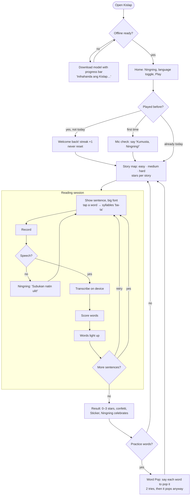

# Activity diagram — a child's whole visit

```mermaid
flowchart TD
  Start([Open Kislap]) --> Ready{Offline ready?}
  Ready -- no --> DL[Download model with progress bar<br/>'Inihahanda ang Kislap…'] --> Ready
  Ready -- yes --> Home[Home: Ningning, language toggle, Play]
  Home --> Streak{Played before?}
  Streak -- "yes, not today" --> WB[Welcome back! streak +1<br/>never reset] --> Map
  Streak -- "first time" --> Mic[Mic check: say 'Kumusta, Ningning!'] --> Map
  Streak -- "already today" --> Map
  Map[Story map: easy · medium · hard<br/>stars per story] --> Read

  subgraph Read[Reading session]
    S1[Show sentence, big font<br/>tap a word → syllables 'ba-ta'] --> Rec[Record] --> Gate{Speech?}
    Gate -- no --> Kind[Ningning: 'Subukan natin ulit!'] --> S1
    Gate -- yes --> ASR[Transcribe on device] --> Score[Score words] --> Lit[Words light up]
    Lit --> More{More sentences?}
    More -- "retry" --> S1
    More -- yes --> S1
  end

  More -- no --> Result[Result: 0–3 stars, confetti,<br/>Sticker, Ningning celebrates]
  Result --> PW{Practice words?}
  PW -- yes --> Pop[Word Pop: say each word to pop it<br/>2 tries, then it pops anyway] --> Map
  PW -- no --> Map
```
