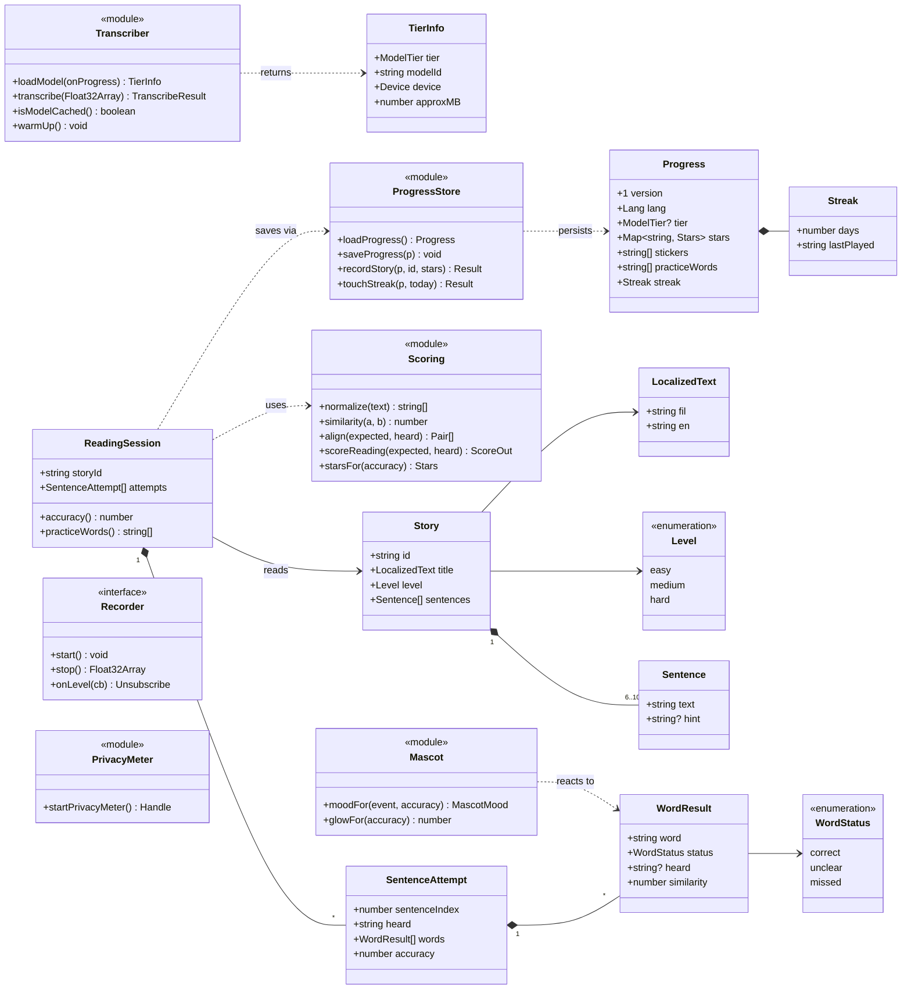

# Class diagram (domain and module contracts)

TypeScript interfaces and modules from `docs/architecture.md`. `«module»` means a file of
functions, not a class.

```mermaid
classDiagram
  direction LR

  class Story {
    +string id
    +LocalizedText title
    +Level level
    +Sentence[] sentences
  }
  class Sentence {
    +string text
    +string? hint
  }
  class LocalizedText {
    +string fil
    +string en
  }
  class Level {
    <<enumeration>>
    easy
    medium
    hard
  }
  Story "1" *-- "6..10" Sentence
  Story --> Level
  Story --> LocalizedText

  class ReadingSession {
    +string storyId
    +SentenceAttempt[] attempts
    +accuracy() number
    +practiceWords() string[]
  }
  class SentenceAttempt {
    +number sentenceIndex
    +string heard
    +WordResult[] words
    +number accuracy
  }
  class WordResult {
    +string word
    +WordStatus status
    +string? heard
    +number similarity
  }
  class WordStatus {
    <<enumeration>>
    correct
    unclear
    missed
  }
  ReadingSession "1" *-- "*" SentenceAttempt
  SentenceAttempt "1" *-- "*" WordResult
  WordResult --> WordStatus
  ReadingSession --> Story : reads

  class Progress {
    +1 version
    +Lang lang
    +ModelTier? tier
    +Map~string, Stars~ stars
    +string[] stickers
    +string[] practiceWords
    +Streak streak
  }
  class Streak {
    +number days
    +string lastPlayed
  }
  Progress *-- Streak

  class TierInfo {
    +ModelTier tier
    +string modelId
    +Device device
    +number approxMB
  }

  class Scoring {
    <<module>>
    +normalize(text) string[]
    +similarity(a, b) number
    +align(expected, heard) Pair[]
    +scoreReading(expected, heard) ScoreOut
    +starsFor(accuracy) Stars
  }
  class Transcriber {
    <<module>>
    +loadModel(onProgress) TierInfo
    +transcribe(Float32Array) TranscribeResult
    +isModelCached() boolean
    +warmUp() void
  }
  class Recorder {
    <<interface>>
    +start() void
    +stop() Float32Array
    +onLevel(cb) Unsubscribe
  }
  class Mascot {
    <<module>>
    +moodFor(event, accuracy) MascotMood
    +glowFor(accuracy) number
  }
  class ProgressStore {
    <<module>>
    +loadProgress() Progress
    +saveProgress(p) void
    +recordStory(p, id, stars) Result
    +touchStreak(p, today) Result
  }
  class PrivacyMeter {
    <<module>>
    +startPrivacyMeter() Handle
  }

  ReadingSession ..> Scoring : uses
  ReadingSession ..> ProgressStore : saves via
  ProgressStore ..> Progress : persists
  Transcriber ..> TierInfo : returns
  Mascot ..> WordResult : reacts to
```
