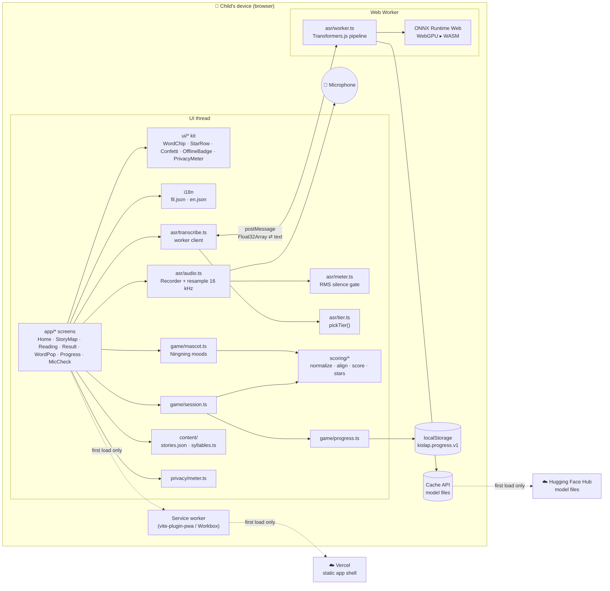

# Component diagram

Boxes are modules from `docs/architecture.md`. Arrows are "calls / imports". The dashed
boundary is the device. The only arrows that cross it happen on the first load.

```mermaid
flowchart LR
  subgraph Device["📱 Child's device (browser)"]
    direction LR
    subgraph UI["UI thread"]
      Screens["app/* screens<br/>Home · StoryMap · Reading · Result · WordPop · Progress · MicCheck"]
      UIKit["ui/* kit<br/>WordChip · StarRow · Confetti · OfflineBadge · PrivacyMeter"]
      I18n["i18n<br/>fil.json · en.json"]
      Audio["asr/audio.ts<br/>Recorder + resample 16 kHz"]
      Meter["asr/meter.ts<br/>RMS silence gate"]
      Transcribe["asr/transcribe.ts<br/>worker client"]
      Tier["asr/tier.ts<br/>pickTier()"]
      Scoring["scoring/*<br/>normalize · align · score · stars"]
      Session["game/session.ts"]
      Mascot["game/mascot.ts<br/>Ningning moods"]
      Progress["game/progress.ts"]
      Content["content/<br/>stories.json · syllables.ts"]
      Privacy["privacy/meter.ts"]
    end
    subgraph W["Web Worker"]
      Worker["asr/worker.ts<br/>Transformers.js pipeline"]
      ORT["ONNX Runtime Web<br/>WebGPU ▸ WASM"]
    end
    SW["Service worker<br/>(vite-plugin-pwa / Workbox)"]
    LS[("localStorage<br/>kislap.progress.v1")]
    Cache[("Cache API<br/>model files")]
    Mic(("🎤 Microphone"))
  end

  Vercel["☁️ Vercel<br/>static app shell"]
  HF["☁️ Hugging Face Hub<br/>model files"]

  Screens --> UIKit & I18n & Session & Mascot & Audio & Content & Privacy
  Audio --> Mic
  Audio --> Meter
  Screens --> Transcribe
  Transcribe --> Tier
  Transcribe <-->|postMessage<br/>Float32Array ⇄ text| Worker
  Worker --> ORT
  Worker --> Cache
  Session --> Scoring
  Session --> Progress
  Mascot --> Scoring
  Progress --> LS
  Screens -.->|first load only| SW
  SW -.->|first load only| Vercel
  Cache -.->|first load only| HF
```
