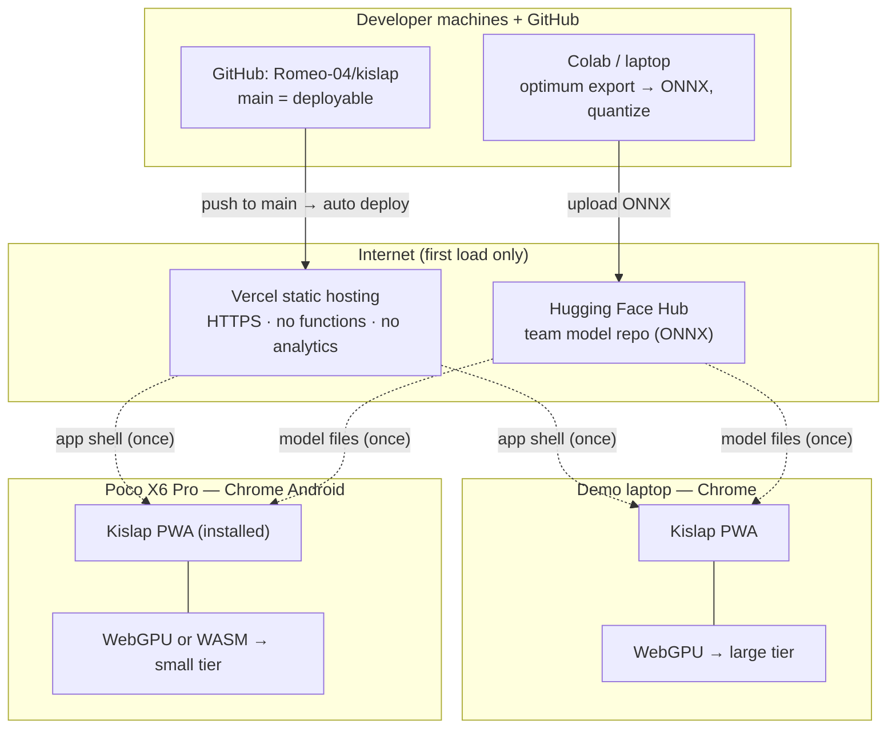

# Deployment diagram

```mermaid
flowchart TB
  subgraph Build["Developer machines + GitHub"]
    GH["GitHub: Romeo-04/kislap<br/>main = deployable"]
    Colab["Colab / laptop<br/>optimum export → ONNX, quantize"]
  end

  subgraph Cloud["Internet (first load only)"]
    Vercel["Vercel static hosting<br/>HTTPS · no functions · no analytics"]
    HF["Hugging Face Hub<br/>team model repo (ONNX)"]
  end

  subgraph Laptop["Demo laptop — Chrome"]
    LB["Kislap PWA"]
    LGPU["WebGPU → large tier"]
  end

  subgraph Phone["Poco X6 Pro — Chrome Android"]
    PB["Kislap PWA (installed)"]
    PCPU["WebGPU or WASM → small tier"]
  end

  GH -- "push to main → auto deploy" --> Vercel
  Colab -- "upload ONNX" --> HF
  Vercel -. "app shell (once)" .-> LB & PB
  HF -. "model files (once)" .-> LB & PB
  LB --- LGPU
  PB --- PCPU
```
