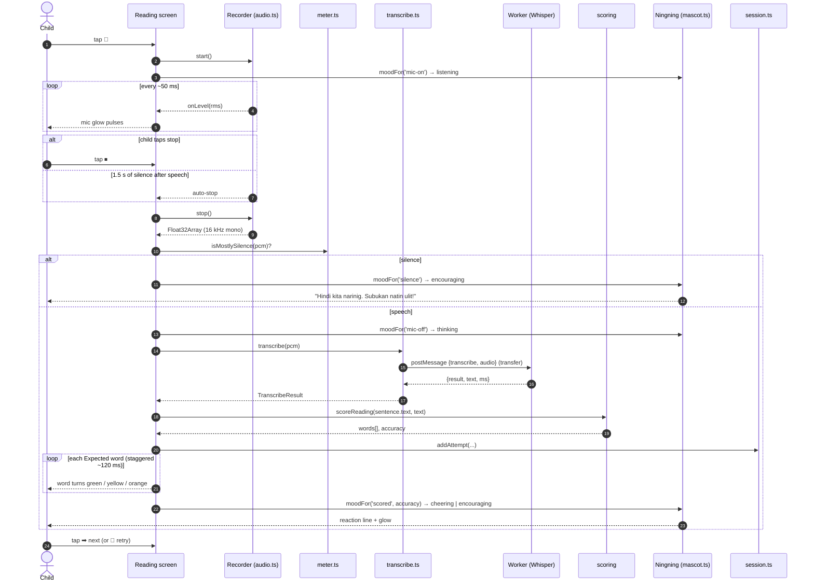
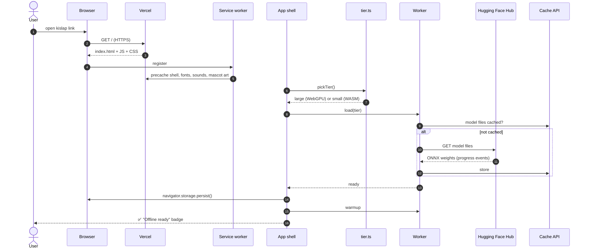

# Sequence diagrams

## 1. Read one Sentence (the Must loop)

```mermaid
sequenceDiagram
  autonumber
  actor Child
  participant R as Reading screen
  participant A as Recorder (audio.ts)
  participant M as meter.ts
  participant T as transcribe.ts
  participant W as Worker (Whisper)
  participant S as scoring
  participant N as Ningning (mascot.ts)
  participant G as session.ts

  Child->>R: tap 🎤
  R->>A: start()
  R->>N: moodFor('mic-on') → listening
  loop every ~50 ms
    A-->>R: onLevel(rms)
    R-->>Child: mic glow pulses
  end
  alt child taps stop
    Child->>R: tap ⏹
  else 1.5 s of silence after speech
    A-->>R: auto-stop
  end
  R->>A: stop()
  A-->>R: Float32Array (16 kHz mono)
  R->>M: isMostlySilence(pcm)?
  alt silence
    R->>N: moodFor('silence') → encouraging
    N-->>Child: "Hindi kita narinig. Subukan natin ulit!"
  else speech
    R->>N: moodFor('mic-off') → thinking
    R->>T: transcribe(pcm)
    T->>W: postMessage {transcribe, audio} (transfer)
    W-->>T: {result, text, ms}
    T-->>R: TranscribeResult
    R->>S: scoreReading(sentence.text, text)
    S-->>R: words[], accuracy
    R->>G: addAttempt(...)
    loop each Expected word (staggered ~120 ms)
      R-->>Child: word turns green / yellow / orange
    end
    R->>N: moodFor('scored', accuracy) → cheering | encouraging
    N-->>Child: reaction line + glow
  end
  Child->>R: tap ➡ next (or 🔁 retry)
```

## 2. First load and Offline ready

```mermaid
sequenceDiagram
  autonumber
  actor User
  participant B as Browser
  participant V as Vercel
  participant SW as Service worker
  participant App as App shell
  participant Tier as tier.ts
  participant W as Worker
  participant HF as Hugging Face Hub
  participant C as Cache API

  User->>B: open kislap link
  B->>V: GET / (HTTPS)
  V-->>B: index.html + JS + CSS
  B->>SW: register
  SW->>V: precache shell, fonts, sounds, mascot art
  App->>Tier: pickTier()
  Tier-->>App: large (WebGPU) or small (WASM)
  App->>W: load(tier)
  W->>C: model files cached?
  alt not cached
    W->>HF: GET model files
    HF-->>W: ONNX weights (progress events)
    W->>C: store
  end
  W-->>App: ready
  App->>B: navigator.storage.persist()
  App->>W: warmup
  App-->>User: ✅ "Offline ready" badge
```
