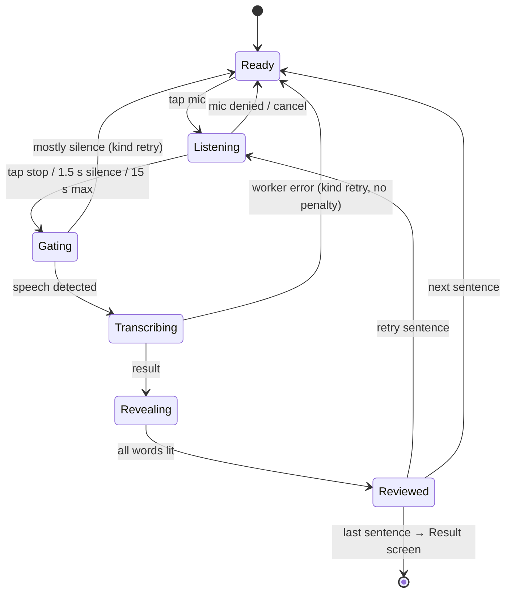
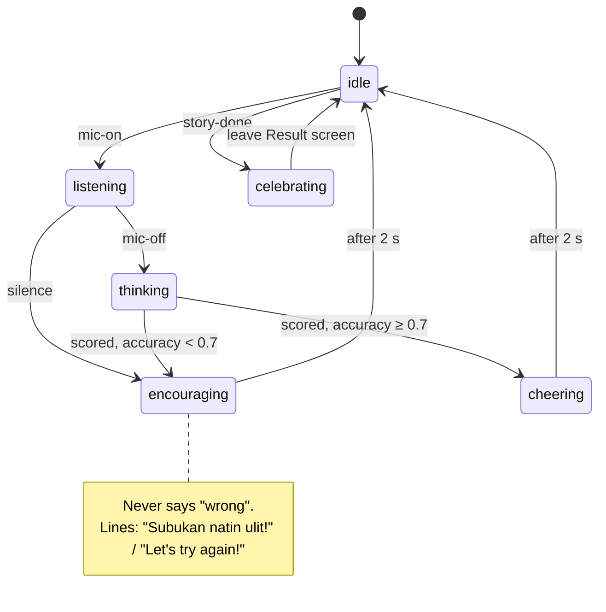
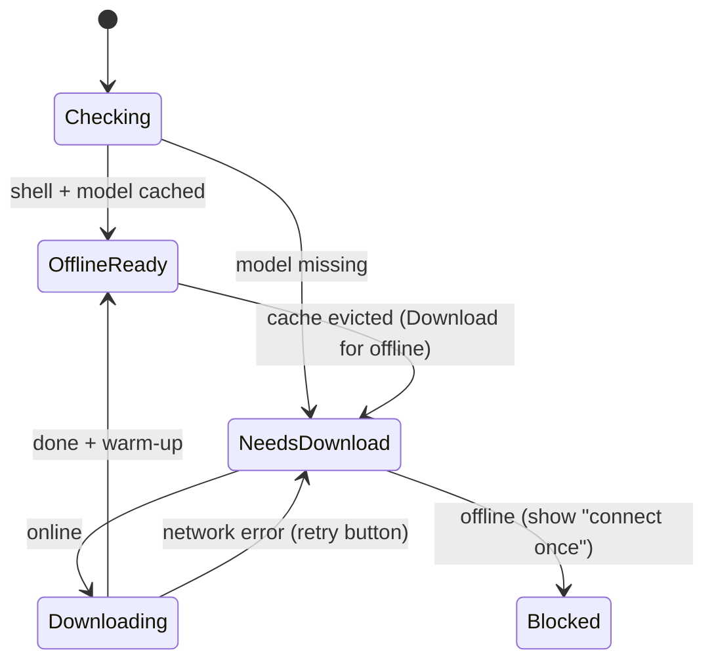

# State machines

## 1. Reading screen (one Sentence)

```mermaid
stateDiagram-v2
  [*] --> Ready
  Ready --> Listening : tap mic
  Listening --> Ready : mic denied / cancel
  Listening --> Gating : tap stop / 1.5 s silence / 15 s max
  Gating --> Ready : mostly silence (kind retry)
  Gating --> Transcribing : speech detected
  Transcribing --> Revealing : result
  Transcribing --> Ready : worker error (kind retry, no penalty)
  Revealing --> Reviewed : all words lit
  Reviewed --> Listening : retry sentence
  Reviewed --> Ready : next sentence
  Reviewed --> [*] : last sentence → Result screen
```

## 2. Ningning (Mascot mood)

```mermaid
stateDiagram-v2
  [*] --> idle
  idle --> listening : mic-on
  listening --> thinking : mic-off
  listening --> encouraging : silence
  thinking --> cheering : scored, accuracy ≥ 0.7
  thinking --> encouraging : scored, accuracy < 0.7
  cheering --> idle : after 2 s
  encouraging --> idle : after 2 s
  idle --> celebrating : story-done
  celebrating --> idle : leave Result screen
  note right of encouraging
    Never says "wrong".
    Lines: "Subukan natin ulit!" / "Let's try again!"
  end note
```

## 3. App readiness (offline)

```mermaid
stateDiagram-v2
  [*] --> Checking
  Checking --> OfflineReady : shell + model cached
  Checking --> NeedsDownload : model missing
  NeedsDownload --> Downloading : online
  NeedsDownload --> Blocked : offline (show "connect once")
  Downloading --> OfflineReady : done + warm-up
  Downloading --> NeedsDownload : network error (retry button)
  OfflineReady --> NeedsDownload : cache evicted (Download for offline)
```
