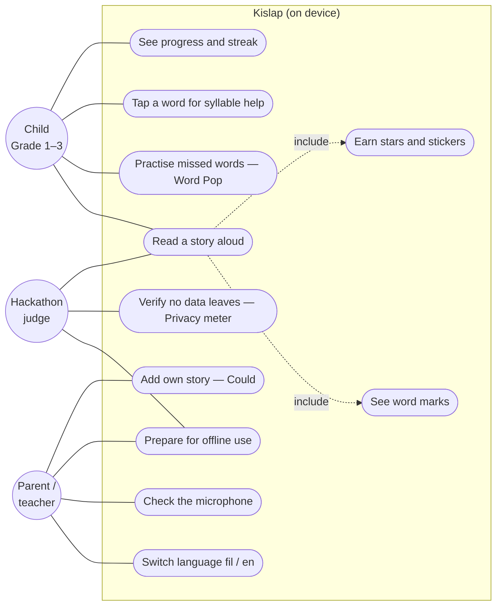

# Use case diagram

Mermaid has no native use-case diagram, so actors are circles and use cases are rounded boxes.

```mermaid
flowchart LR
  Child((Child<br/>Grade 1–3))
  Adult((Parent /<br/>teacher))
  Judge((Hackathon<br/>judge))

  subgraph Kislap["Kislap (on device)"]
    UC1([Read a story aloud])
    UC2([See word marks])
    UC3([Earn stars and stickers])
    UC4([Practise missed words — Word Pop])
    UC5([Tap a word for syllable help])
    UC6([Switch language fil / en])
    UC7([Check the microphone])
    UC8([Prepare for offline use])
    UC9([See progress and streak])
    UC10([Verify no data leaves — Privacy meter])
    UC11([Add own story — Could])
  end

  Child --- UC1 & UC4 & UC5 & UC9
  UC1 -. include .-> UC2
  UC1 -. include .-> UC3
  Adult --- UC6 & UC7 & UC8 & UC11
  Judge --- UC8 & UC10 & UC1
```
